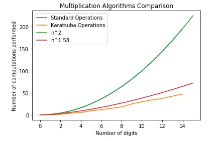

# Multiplication Case Study

Recently I came across a video regarding Karatsuba's Fast Multiplication Algorithm (https://www.youtube.com/watch?v=cCKOl5li6YM&t=788s) and decided to implement it in python. I followed the pseudocode from wikipedia regarding the algorithm (https://en.wikipedia.org/wiki/Karatsuba_algorithm) to implement my method. 

To examine the effect that using Karatsuba's Fast Multiplication Algorithm has on real-time computations, I also implemented a standard elementary-school long multiplcation algorithm. To compare the two, I added operation counters within both methods that keep track of the respective number of  addition and multiplication calculations being performed. 

Finally, I simulated both algorithms being called 200 times for numbers ranging from 1 to upperBound (in my case 15) digits, averaged the operations performed and graphed them against the respective number of digits. 

This resulted in the graph shown below that highlights the standard multiplication algorithm following the n^2 curve, while the Karatsuba multiplcation algorithm roughly follows an n^1.58 curve.

*Note: The n^2 line overlaps the standard algorithm curve.*

*Note: The Karatsuba operation count may not be completely accurate which results in the respective line not following the n^1.58 curve as closely as I had hoped.*
